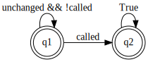

# 3. Debugging Smart Contracts with SmartACE

Solidity supports pre- and post-conditions through the `require` and `assert`
statements. As shown in the [previous tutorial](2_getting_started.md), these are
sufficient for simple representation invariants. However, for more complex
properties, especially between two or more contracts, manual instrumentation
becomes difficult and error-prone.

In this tutorial, we show how smart contract invariants can be expressed in
temporal logic, converted into monitors, and then instrumented mechanically.
This instrumentation will be automated in future versions of SmartACE.

This tutorial requires [Seahorn and clang-format](1_installation.md).

## Invariants Across Multiple Contracts

The following Solidity program gives a `Fund` contract which can `open()` and
`close()`. While open, users can `deposit()` Ether into the fund. The `Manager`
smart contract constructs a fund for which it is the owner. The fund should open
once `openFund()` is called on `Manager`.

```solidity
contract Fund {
    bool isOpen;
    address owner;

    constructor() public { owner = msg.sender; }

    function claim() public {
        owner = msg.sender;
    }

    function open() public {
        require(msg.sender == owner);
        isOpen = true;
    }

    function close() public {
        require(msg.sender == owner);
        isOpen = false;
    }

    function deposit() public payable { require(isOpen); }
}

contract Manager {
    Fund fund;

    constructor() public { fund = new Fund(); }

    function openFund() public { fund.open(); }
}
```

At first glance it may appear that the balance of fund will not change unless
`openFund()` is called. This is because calls to `open()` are checked against
the current owner. However, ownership exploits are an issue in
[real smart contracts](https://blog.openzeppelin.com/on-the-parity-wallet-multisig-hack/).
Let's use SmartACE to see if this invariant really holds.

## Encoding the Property

The first step in encoding the property is to state it precisely. Our logic of
choice is past linear temporal logic (pLTL). We start with an informal statement
of the property.

> It is *always* the case that if `openBank()` is *not* called even *once*, then
> the balance of `Manager.fund` *prior to* and after the last transaction
> remains unchanged.

We can formalize this using the
[VerX Specification Language](https://verx.ch/docs/spec.html). This is a smart
contract specification language, where `FUNCTION` refers to the function called
in the last transaction, while `prev()` is an operator which returns the value
of a variable before the last transaction. `always` and `once` are the
corresponding pLTL operators. Our property becomes:

```
always(
    !(once(FUNCTION == Manager.openBank()))
    =>
    (BALANCE(Fund) == prev(BALANCE(Fund)))
)
```

To detect property violations, we convert the property into a monitor. For
brevity, we introduce the following predicates:

  * `called := (FUNCTION == Manager.openBank())`.
  * `unchanged := (BALANCE(Fund) == prev(BALANCE(Fund)))`

The regular expression for the monitor is  `unchanged* called True*`. The
corresponding automaton is as follows:



The next section walks through instrumenting the model with the monitor. This
procedure is currently manual, but will be automated in a future release of
SmartACE. The readers less interested in these details can safely skip to the
[final section](#debugging-the-contract).

## Instrumenting the Model

We can encode the monitor using three ghost variables and a single assertion.
One ghost variable (`called_openFund`) will track when `Bank.openFund` is
called. The second and third ghost variables (`pre_Fund_balance` and
`post_sum_balance`) will store the values of `BALANCE(Fund)` both before and
after each transaction. We will assert that `called_openFund` implies
`pre_Fund_balance` equals `post_Fund_balance`. 

To start, save the program as `fund.sol` and then run:

```
path/to/solc fund.sol --bundle=Manager --c-model --output-dir=fund
```

We will start by inspecting the SmartACE artifacts. You should see:

  * `CMakeLists.txt`: generates make targets for fuzzing, symbolic execution,
    simulation, and model checking.
  * `cmodel.c`: provides the model we are verifying.
  * `harness.c`: provides the entry-point (`main`) to the model.
  * `primitives.h`: header-only library which defines C primitives for Solidity
    primitive types.
  * `libverify/`: runtime libraries which define how require, assert, etc., are
    handled in each model.

To instrument the model, we will need to modify `cmodel.c`. The code is not
human-readable but we can improve this with `clang-format`:

  * `mdkir build ; cd build`
  * `cmake .. -DSEA_PATH=/path/to/seahorn/bin`
  * `make run-clang-format`

Now open `cmodel.c`. Let's start by declaring our ghost variables at the top of
the file. We will use the Solidity type wrappers provided by `primitives.h`, and
the ghost variable macro found in `libverify`. For now `GHOST_VAR` is a
placeholder, but will be used for analysis specific
[attributes](https://clang.llvm.org/docs/AttributeReference.html) in a future
release of SmartACE.

```cpp
GHOST_VAR int called_openFund;
GHOST_VAR sol_uint256_t pre_balance;
GHOST_VAR sol_uint256_t post_balance;
```

We can set `call_openFund` on entry to `openFund`. This is sufficient, as there
is a single instance of `Manager`. As for `pre_` and `post_balance`, we must set
these variables at the beginning and end of each transaction. To find `openFund`
we appeal to the SmartACE naming conventions:

  * A constructor is an unnamed method, which is mapped to `Manager_Constructor`.
  * A fallback is an unnamed method, which is mapped to `Manager_Fallback`.
  * A method, say `openFund`, is mapped to `Manager_Method_openFund`.

Using this, we find `openFund` at line 77 and rewrite it as:

```cpp
void Manager_Method_openFund(struct Manager *self, /* Blockchain State */) {
    called_openFund = 1;
    Fund_Method_open(&self->user_fund, /* Blockchain State */);
}

```

We then move on to the entry-point, `void run_model(void)`, at line 85. We must
identify the variable which maps to `Manager.fund`, and then locate the code
which executes transactions. If we move ahead to line 102 we can see where
`Manager` is constructed:

```cpp
smartace_log("[Initializing contract_0]");
sender.v = nd_range(3, 5, "sender");
value.v = 0;
blocknum.v = nd_increase(blocknum.v, 0, "blocknum");
timestamp.v = nd_increase(timestamp.v, 0, "timestamp");
Init_Manager(&contract_0, sender, value, blocknum, timestamp, paid, origin);

```

To summarize briefly, each method prefixed by `nd_` selects a value
non-deterministically. These values are used to model an arbitrary `msg.sender`,
and an increasing `block.number` and `block.timestamp`. An attentive reader may
notice that we restrict addresses to 3 and 4. The importance of this choice, and
its impact on completeness, are the topic of the next tutorial. For now we can
think of this as a bounded model with two clients, so at the least, our
verification is sound. Regardless, we have found the declaration for `Manager`,
and by referring to line 8, we also learn how to access `balance`:

```cpp
struct Fund {
    sol_address_t model_address;
    sol_uint256_t model_balance;
    sol_bool_t user_isOpen;
    sol_address_t user_owner;
};

struct Manager {
    sol_address_t model_address;
    sol_uint256_t model_balance;
    struct Fund user_fund;
};
```

Members prefixed by `user_` are taken from the smart contract definition while
members prefixed by `model_` are generated by SmartACE. To get the balance of
`Fund` we must access `contract_0.user_fund.model_balance`.

At line 108 we then find the "transaction loop" which simulates a sequence of
transitions:

```cpp
smartace_log("[Entering transaction loop]");
while (sol_continue()) {
    sol_on_transaction();
    /* ... Select non-deterministic blockchain state ... */
    uint8_t next_call = nd_range(0, 5, "next_call");
    switch (next_call) {
    case 0: {
        smartace_log("[Calling openFund on contract_0]");
        Manager_Method_openFund(&(contract_0), /* Blockchain state */);
        smartace_log("[Call successful]");
        break;
    }
    /* ... Other methods ... */
    }
}
```

The `Seahorn` implementation of `sol_continue` always returns `true`, so the
loop runs forever. On each iteration, a method is called non-deterministically.
The method is determined by `next_call`. We instrument the final ghost
variables, and the assertion as follows:

```cpp
while (sol_continue()) {
    /* ... Method selection ... */
    pre_balance = contract_0.user_fund.user_balances;
    switch (next_call) {
    /* ... Method call ... */
    }
    post_balance = contract_0.user_fund.user_balances;
    sol_assert(called_openFund || pre_balance.v == post_balance.v, 0);
}

```

Now if we run `make verify` we will see that the property is violated.

## Debugging the Contract

When `Seahorn` detects that an assertion can be violated, it can generate a
counterexample. This counterexample resolves all non-determinism with concrete
values, and terminates in an assertion failure. Thankfully, `Seahorn` provides
these counterexamples are LLVM programs. We can link it against our executable
model to produce a debuggable trace (a witness).

In practice, we could analyze this trace using a debugger such as `gdb`.
However, in this example, it is sufficient to read a trace log from the witness.
Let's reconfigure our example with logging, and then build the witness:

  * `cmake .. -DSEA_EXELOG=true`
  * `make witness`
  * `./witness`

This gives the trace:

```
[Initializing contract_0]
sender [uint8]: 3
blocknum [uint256]: 0
timestamp [uint256]: 0
[Entering transaction loop]
sender [uint8]: 3
blocknum [uint256]: 0
timestamp [uint256]: 0
next_call [uint8]: 1
[Calling claim on contract_1]
[Call successful]
sender [uint8]: 3
blocknum [uint256]: 0
timestamp [uint256]: 0
next_call [uint8]: 2
[Calling open on contract_1]
[Call successful]
sender [uint8]: 3
blocknum [uint256]: 0
timestamp [uint256]: 0
next_call [uint8]: 4
[Calling deposit on contract_1]
value [uint256]: 1
[Call successful]
[sea] __VERIFIER_error was executed
```

If we follow through this trace, we can see a single client `claim`:

  1. Acquire ownership of `fund` through `claim`.
  2. Transition `fund` to an accepting state through `open`.
  3. Move a single Ether into `fund` through `deposit`.

This is the counterexample we suspected, and it is not spurious.
