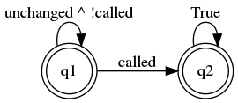

# 3. Debugging Smart Contracts for Functional Correctness

Solidity makes it easy to instrument pre- and post-conditions with `require` and
`assert` statements. As shown in the [previous tutorial](2_getting_started.md),
its also reasonable to instrument checks for representation invariants. However,
for complex properties, it is often easier to instrument the model directly.

In this tutorial we will see how SmartACE models map-free smart contracts, and
then learn how to instrument and debug requirements on these models.

This tutorial requires [Seahorn and clang-format](1_installation.md).

## Invariants Across Multiple Contracts

The following Solidity program gives a `Fund` contract which can `open()` and
`close()`. While open, users can `deposit()` Ether into the fund. The `Manager`
smart contract constructs a fund for which it is the owner. The fund should open
once `openFund()` is called on `Manager`.

```solidity
contract Fund {
    bool isOpen;
    address owner;

    constructor() public { owner = msg.sender; }

    function claim() public {
        owner = msg.sender;
    }

    function open() public {
        require(msg.sender == owner);
        isOpen = true;
    }

    function close() public {
        require(msg.sender == owner);
        isOpen = false;
    }

    function deposit() public payable { require(isOpen); }
}

contract Manager {
    Fund fund;

    constructor() public { fund = new Fund(); }

    function openFund() public { fund.open(); }
}
```

We want to verify that until `openFund()` is called, the `balance` of `fund`
never changes. We will see that this is not the case, as any client can
`claim()` ownership of `fund` from `Manager`. Unfortunately, ownership exploits
in real smart contracts are often more subtle, and model checking is one way to
detect these bugs.

## Encoding the Property

Let's start by formalizing the property. First we will need a specification
language. This example uses the
[VerX Specification Language](https://verx.ch/docs/spec.html) due to its support
for linear temporal logic (LTL), and its similarity to the Solidity language:

```
always(
    !(once(FUNCTION == Manager.openBank()))
    =>
    (BALANCE(Fund) == prev(BALANCE(Fund)))
)
```

As with all LTL properties, we can construct a monitor to detects when the
property is violated. The corresponding automaton is as follows:



(*SW: This monitor is not "quite" the property. Formally, we think of a transaction as being a relation between two states but we don't have a notation to talk about this. Instead, I've partitioned the calls into methods which change the balance of `Manager.fund` and those which do not.*)

At this time, SmartACE do not automate property instrumentation. The next
section describes how it could be done by hand. The reader less interested in
these details may safely skip to the final section.

## Instrumenting the Model

Start by saving the program as `fund.sol` and then run:

```
path/to/solc fund.sol --bundle=Manager --c-model --output-dir=fund
```

Let's take a look at the artifacts generated by the tool. You should see:

  * `CMakeLists.txt`: generates make targets for fuzzing, symbolic execution,
    simulation, and model checking.
  * `cmodel.c`: provides the model we are verifying.
  * `harness.c`: provides the entry-point (`main`) to the model.
  * `primitives.h`: header-only library which defines C primitives for Solidity
    primitive types.
  * `libverify/`: runtime libraries which define how require, assert, etc., are
    handled in each model.

To instrument the model, we will need to modify `cmodel.c`. The code is not
human-readable but we can fix this with `clang-format`:

  * `mdkir build ; cd build`
  * `cmake .. -DSEA_PATH=/path/to/seahorn/bin`
  * `make run-clang-format`

Now open `cmodel.c`. At the top we can see how each contract is encoded:

```cpp
struct Fund {
    sol_address_t model_address;
    sol_uint256_t model_balance;
    sol_bool_t user_isOpen;
    sol_address_t user_owner;
};

struct Manager {
    sol_address_t model_address;
    sol_uint256_t model_balance;
    struct Fund user_fund;
};
```

Members prefixed by `user_` are taken from the smart contract definition while
members prefixed by `model_` are generated by SmartACE. As we can also see here,
all primitive Solidity types are wrapped by singleton structures. To get the
balance of `Fund` we must access `model_balance.v`.

Now navigate to `void run_model(void)`. This method is the entry-point to our
model. After some bootstrapping, we can see `Manager` initialized:

```cpp
smartace_log("[Initializing contract_0]");
sender.v = nd_range(3, 5, "sender");
value.v = 0;
blocknum.v = nd_increase(blocknum.v, 0, "blocknum");
timestamp.v = nd_increase(timestamp.v, 0, "timestamp");
Init_Manager(&contract_0, sender, value, blocknum, timestamp, paid, origin);
```

Each method prefixed by `nd_` will produce non-deterministic values. In the
above code, `Manager` is initialized using a non-deterministic blockchain state
In particular, we model `msg.sender`, `msg.value`, an increasing `block.number`,
and an increasing `block.timestamp`. An attentive reader may notice that we
restrict the sender to addresses 3 and 4. We will show in a later post why this
is sufficient for soundness. Regardless, we now know that the balance of `fund`
is `contract_0.user_fund.user_balances`.

Moving on, we enter a loop which simulates a sequence of transitions:

```cpp
smartace_log("[Entering transaction loop]");
while (sol_continue()) {
    sol_on_transaction();
    sender.v = nd_range(3, 5, "sender");
    value.v = 0;
    blocknum.v = nd_increase(blocknum.v, 0, "blocknum");
    timestamp.v = nd_increase(timestamp.v, 0, "timestamp");
    uint8_t next_call = nd_range(0, 5, "next_call");
    switch (next_call) {
    case 0: {
        smartace_log("[Calling openFund on contract_0]");
        Method_Manager_FuncopenFund(&(contract_0), sender, value, blocknum, timestamp, paid, origin);
        smartace_log("[Call successful]");
        break;
    }
    /* ... */
    }
}
```

The `Seahorn` implementation of `sol_continue` always returns `true`, so the
loop runs forever. On each iteration, a method is called non-deterministically.
The method is determined by `next_call`. To instrument the contract, we must
find the cases which corresponds to `Manager.openFund()`. This is easy if we
understand the SmartACE naming conventions:

  * A constructor is an unnamed method, which is mapped to `Init_Manager`.
  * A fallback is an unnamed method, which is mapped to `Fallback_Manager`.
  * A method, say `openFund`, is mapped to `Method_Manager_FuncopenFund`.

(*SW: This example doesn't talk about inheritance. If contract `A` extends `B` and calls `B.f` we write `Method_B_for_A_funcf`.*)

(*SW: I suggest `CONTRACT_Method(_For_OVERRIDE)_METHODNAME`, `CONTRACT_INIT`, and `CONTRACT_FALLBACK`. Modifiers will come before `_METHODNAME`.*).

Our monitor is defined over transactions, so we can embed it in this loop using
standard techniques:

```cpp
int called = 0; // Ghost var 1.
while (sol_continue()) {
    sol_on_transaction();
    sol_uint256_t pre_balance = contract_0.user_fund.user_balances; // Ghost var 2.
    /* ... */
    uint8_t next_call = nd_range(0, 5, "next_call");
    switch (next_call) {
    case 0: {
        called = 1; // Update ghost var 1.
        /* ... */
        break;
    }
    /* ... */
    }
    sol_uint256_t post_balance = contract_0.user_fund.user_balances; // Ghost var 3.
    sol_assert(called || pre_balance.v == post_balance.v, 0); // Property.
}

```

Now if we run `make verify` we will see that the property is violated.

## Debugging the Model

When `Seahorn` detects that an assertion can be violated, it can generate a
counterexample. This counterexample resolves all non-determinism with concrete
values, and terminates in an assertion failure. Thankfully, `Seahorn` provides
these counterexamples are LLVM programs. We can link it against our executable
model to produce a debuggable trace (a witness).

In practice, we could analyze this trace using a debugger such as `gdb`.
However, in this example, it is sufficient to read a trace log from the witness.
Let's reconfigure our example with logging, and then build the witness:

  * `cmake .. -DSEA_EXELOG=true`
  * `make witness`
  * `./witness`

This gives the trace:

```
[Initializing contract_0]
sender [uint8]: 3
blocknum [uint256]: 0
timestamp [uint256]: 0
[Entering transaction loop]
sender [uint8]: 3
blocknum [uint256]: 0
timestamp [uint256]: 0
next_call [uint8]: 1
[Calling claim on contract_1]
[Call successful]
sender [uint8]: 3
blocknum [uint256]: 0
timestamp [uint256]: 0
next_call [uint8]: 2
[Calling open on contract_1]
[Call successful]
sender [uint8]: 3
blocknum [uint256]: 0
timestamp [uint256]: 0
next_call [uint8]: 4
[Calling deposit on contract_1]
value [uint256]: 1
[Call successful]
[sea] __VERIFIER_error was executed
```

If we follow through this trace, we can see a single client `claim`:

  1. Acquire ownership of `fund` through `claim`.
  2. Transition `fund` to an accepting state through `open`.
  3. Move a single Ether into `fund` through `deposit`.

This is the counterexample we suspected, and it is not spurious.
