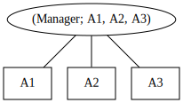
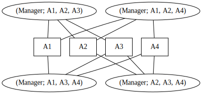

# 5. Reasoning About Client State in SmartACE

[Last time](4_arbitrary_clients.md) we used SmartACE to prove safety properties
for any number of clients. The example was by no means trivial, but it was in
many ways a toy. Namely, the `Manager` bundle we analyzed did not keep mappings
from client addresses to client data. In such cases we must
summarize both the client addresses and the client data.

In this post we will prove a simple invariant with client data. First, we extend
the `Manager` bundle to use maps, and describe the property of interest. We then
revisit network topology to better understand the impact of client data. Using
this insight, we then work on summarizing the client data. Finally, we show how
SmartACE applies this theory in practice, and then use it to verify our new
property.

## Extending Our Running Example

Let's start by returning to the `Manager` bundle. To briefly recap, the
`Manager` bundle consists of two smart contracts: a `Fund` for clients to
`deposit()` Ether, and a `Manager` which owns and controls access to the `Fund`.
In the past two tutorials we
[identified an ownership exploit](3_transactions.md), patched the bug, and then
[verified its absence for any number of clients](4_arbitrary_clients.md).

We now wish to move on to mapping properties. To keep our example realistic, we
add an `investment` mapping to `Fund` which tracks how much Ether each client
deposits. We add a `Fund.transfer(address, uint256)` method which allows a
client to relinquish `_amount` Ether to `_destination`. The new contract is
given below:

```solidity
contract Fund {
    bool isOpen;
    address owner;

    mapping(address => uint) invested;

    constructor() public { owner = msg.sender; }

    // Access controls.
    modifier ownerOnly() { require(owner == msg.sender); _; }
    function releaseTo(address _new) public ownerOnly { owner = _new; }
    function open() public ownerOnly { isOpen = true; }
    function close() public ownerOnly { isOpen = false; }

    // Invest money into fund.
    function deposit() public payable {
        require(isOpen);
        invested[msg.sender] += msg.value;
    }

    // Move money between accounts.
    function transfer(address _destination, uint _amount) {
        require(_amount > 0);
        require(invested[_destination] + _amount > invested[_destination]);
        require(invested[msg.sender] >= _amount);

        invested[msg.sender] -= _amount;
        invested[_destination] += _amount;
    }
}

contract Manager {
    Fund fund;

    constructor() public { fund = new Fund(); }

    function openFund() public { fund.open(); }
}
```

We can now consider local client properties. In these properties, taken an
invariant for a small set of properties. For example, the total investment for
two fixed clients is conserved after calling `Fund.transfer(address, uint256)`.
We can then extend this into a local client property by requiring that for any
two clients, their total investments are conserved by
`Fund.transfer(address, uint256)`. In fact, this will be our running example for
the remainder of the tutorial. In past linear temporal logic (pLTL) we would
say:

> It is *always* the case that whenever `msg.sender` calls `Fund.transfer()` and
> sends `_amount` to `_dst`, then `Fund.invested[msg.sender]` is decreased by
> `_amount` while  `Fund.invested[_destination]` is increased by `_amount`.

We then formalize the property in the
[VerX Specification Language](https://verx.ch/docs/spec.html). Recall that
`FUNCTION` is the name of the last method called, while `prev(v)` is the value
of `v` before `FUNCTION` was called. `once` and `always` are pLTL operators,
where `once(p)` is true if `p` has ever been true while `always(p)` is true if
`p` has always been true. We write `Fund.transfer(address, uint256)[i]` to refer
to the i-th argument passed to `Fund.transfer(address, uint256)`. This gives the
formalization:

```
always(
    (FUNCTION == Fund.transfer)
    ==>
    (
        (Fund.invested[msg.sender]
            + Fund.transfer(address,uint256)[1]
            == prev(Fund.invested[msg.sender]))
        &&
        (Fund.invested[Fund.transfer(address,uint256)[0]]
            - Fund.transfer(address,uint256)[1]
            == prev(Fund.invested[msg.sender]))
    )
)
```

As a final step, we can constructor a monitor for the property. The monitor will
detect if the property becomes violated, and will allow us to verify the claim.
Our property is essentially a functional post-condition, so the monitor is very
compact. First we introduce the following predicates:

  * `is_transfer := FUNCTION == Fund.transfer`
  * `sent := invested[msg.sender] + _amount = prev(invested[msg.sender])`
  * `recv := prev(invested[_destination]) + _amount = prev(invested[_destination]`

And then give the regular expression `(!is_transfer || (send && recv)) *`.

## Local Reasoning Over Client Mappings

Mappings allow us to associated variables with clients. This fundamentally
changes the `Manager` bundle topology. We can think of this new topology as a
graph with two types of vertices: *process vertices* and *data vertices*. Each
process vertex is assigned to one or more transactions in the `Manager` bundle,
whereas each data vertex is assigned to a single mapping entry. If a process can
write to a mapping entry, there is a directed edge from the process vertex to
the data vertex. If a process can read from a mapping vertex, there is a
directed edge from the data vertex to the process vertex.

This leads us to the general case of local reasoning. We have a network which is
parameterized by the number of processes. Each process has access to some finite
set of shared variables. We will show that all processes accessing the same
variable obey some compositional invariant. We then combine these invariants to
find an invariant of the entire network. We can think of the
[previous tutorial](4_arbitrary_clients.md) as the degenerate case where each
client has zero mapping entries.

### Topology in the `Manager` Bundle

First we need to characterize the `Manager` bundle topology. We will do this by
looking at a given *instance* of the bundle. That is, the topology of the bundle
for a fixed number of clients. We will see that the topology exhibits symmetries
which generalize to any number of clients.

To begin, let's fix the number of clients and consider an arbitrary instance. We
saw in the previous tutorial that each transaction can touch at most 6 clients
at once. Three of these clients are fixed, namely `address(0)`, `address(Fund)`,
and `address(Manager)`. If we fix the final three clients, we obtain a subset of
transactions. If we enumerate all client choices, we enumerate all possible
transactions.

We can use this intuition to assign transitions to processes. First we select
one such subset of clients. We then take the transactions whose addresses are
restricted to these clients. To make this idea more concrete, we can imagine
writing a new contract in which we apply the following modifier to all input
addresses:

```solidity
modifier restrictClients(address _client) {
    require(
        _client == address(0) || _client == address(Manager) ||
        _client == address(Fund) || _client == addr1 ||
        _client == addr3 || _client == addr3
    );
}
```

After restricting the clients, we then assign the transactions to a unique
process vertex. From this vertex, we connect edges to data vertices of each
client. If we repeat this process for each subset of clients, we will map every
transaction onto some process in the network topology.

To illustrate this construction, and to highlight its symmetry, we give the
graphs for 6 and 7 clients. To improve readability, we do not show the data
vertices common to all processes. We name the arbitrary address `A1`, `A2`,
`A3`, and `A4` to stress the point that each address is strictly an identifier.
The topology for 6 clients is:



The topology for 7 clients is:



### Compositional Invariants in the `Manager` Bundle

Local reasoning allows us to take a sufficiently large neighbourhood, against
which we can then prove properties for the entire network. We do this in two
steps. First, we no longer think of each data vertex as belonging to a single
client. Instead, we now let it represent a group of similar clients (formally,
this is an *equivalence class*). We then replace each data vertex with an
invariant which summarizes all possible values at the vertex. We call this
a compositional invariant.

This invariant can be any predicate over the state of the neighbourhood.
Specifically, it can be aware of the class it is summarizing. However, to be
compositional, it must also satisfy three properties.

  1. (Initialization) When the neighbourhood is zero-initialized, the zero
     satisfies the invariant.
  2. (Transaction) If the invariant holds of some clients before they perform a
     transaction, the invariant still holds afterwards.
  3. (Non-interference) If the invariant holds of some client, the actions of
     any other clients cannot break it.

In other words, the compositional invariant holds initially, and is never
violated by any clients.

We can also use this insight to better justify our restricted address values in
the [previous tutorial](4_arbitrary_clients.md). As each address is really a
summary of one or more clients, the address values are no longer meaningful.
Instead, what matters are the relationships satisfied by two or more addresses.
We used the program syntax to identify that only equality mattered, and then we
constructed a set of address values which could satisfy this relation (formally,
we replaced the addresses with an *abstract domain*).

### Local Reasoning in SmartACE

## Proving the Property
